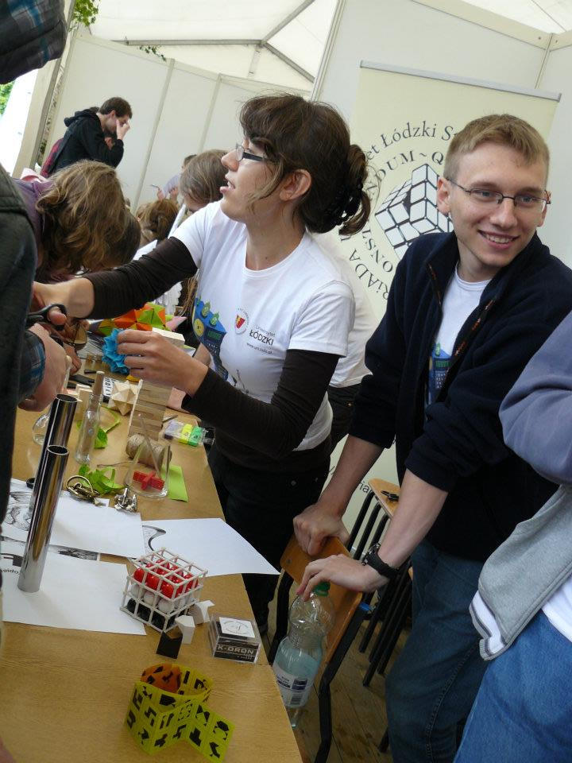

```{r setup, include=FALSE}
knitr::opts_chunk$set(echo = TRUE,warning = FALSE,message = FALSE)
```

# Tidyverse {data-background=#37474F} 

## Tidyverse багцын тухай

* Tidyverse нь өгөгдлийн шинжилгээнд зориулагдсан багцуудын цуглуулга юм. Үүнд: `ggplot2`, `tidyr`, `tibble`, `readr`, `purrr`, `dplyr` болон бусад багцууд хамаарна.
* Дараах командын тусламжтай багцыг суулгана. 

```{r,eval=FALSE}
install.packages("tidyverse")
```
  
* [Data wrangling cheat sheet](https://rstudio.com/wp-content/uploads/2015/02/data-wrangling-cheatsheet.pdf)
* Илүү ихийг [эндээс](https://www.tidyverse.org/) үзнэ үү.

## Data wrangling with dplyr and tidyr

```{r}
library(tidyverse)
library(DT)
datatable(iris, fillContainer = FALSE, options = list(pageLength = 5))
```

## Синтакс

Pipe operator ` %>% `

```{r}
iris %>% group_by(Species) %>% summarise(avg=mean(Sepal.Length))
```


## Хэлбэрийг өөрчлөх өгөгдөл

```{r}
economics
```


## Багануудыг мөрөөр цуглуулах

```{r}
gecon<-gather(economics,"indicators","values",-date)
gecon
```

## Subset observations (Мөр)

```{r}
econ<-economics %>% filter(date<=as.Date("1970-01-01"))
econ
```

## Subset variables (Багана)

```{r}
diamonds
```

---
```{r}
diamonds %>% select(starts_with("c"))
```


## Хураангуйлах

```{r}
diamonds %>% summarise(minimum=min(price),maximum=max(price)) %>%
  print.data.frame()
```

## Бүлэглэх

```{r}
diamonds %>% group_by(cut)
```

## Шинэ хувьсагч үүсгэх

```{r}
diamonds %>% mutate(xy=x*y)
```

## Нэгтгэх

```{r}
df1<-econ %>% select("date","pop")
df2<-econ %>% select("unemploy")
bind_cols(df1,df2)
```

## Ggplot2 - ийн гайхамшиг

Өгөгдлийн хэлбэрийг нь өөрчлөх замаар дараах графикийг дүрслэх боломжтой болно. `gecon` өгөгдөлийг IV-р хуудсанд олж авсан билээ.

```{r}
library(scales) # load package to use comma()

my_plot<-ggplot(gecon,aes(x=date,y=values))+
  geom_line(color="darkblue")+scale_y_continuous(labels = scales::comma)+
  facet_wrap(~indicators, scales = "free", ncol = 3) + 
  labs(x="Date",y="values",title="Economics")

# save plot by pdf format in working directory
ggsave(plot =my_plot , filename = "my_plot.pdf", width = 25.4,
       height = 10.73)
```

## Дүрслэл

```{r}
my_plot
```

---

```{r}
library(plotly)
ggplotly(my_plot) # get interactive plot
```

## Өөр жишээ

```{r}
head(EuStockMarkets,5)

stock<-as.data.frame(EuStockMarkets) %>%
  gather(index,price) %>% 
  mutate(date=rep(time(EuStockMarkets),4))

attach(stock)
```

---

```{r}
plot_ly(x=date, y=price, color = index, mode= "line")
```

## Дүрслэл

```{r}
attach(gecon)
plot_ly(x=date ,y=values, color = indicators, mode="line")
```


# Leatlet 

## The birthplace of R
```{r}
library(leaflet)  # https://rstudio.github.io/leaflet/
leaflet() %>% addTiles() %>%  
  addMarkers(lng=174.768, lat=-36.852, popup="The birthplace of R")
```

## University of financial economics

```{r}
leaflet() %>% addTiles() %>%
  addMarkers(lng=106.930831, lat=47.918574, popup="UFE")
```

# R хэрхэн сурах вэ?
## Хаанаас сурах вэ?

1. [Datacamp](https://www.datacamp.com/search?q=R) 
2. [Edx](https://www.edx.org/course?search_query=R), [coursera](https://www.coursera.org/search?query=R&) болон бусад онлайн сургалт
3. [Youtube](https://www.youtube.com/results?search_query=R+introduction) гэж сайхан багш байна шүү цаана чинь.

## Хэнээс асуух вэ?

R ийн хамгийн том давуу тал нь open source. Иймд маш олон хүн хэрэглэдэг бөгөөд бие биеээсээ асуух бололцоотой.

1. [Stackoverflow](https://stackoverflow.com/search?q=How+can+i+install+R) - асуултаа буруу ойлгуулсан муу [жишээ](https://stackoverflow.com/questions/57587865/how-can-i-add-more-columns-in-dataframe-by-for-loop) 
2. [Facebook groups](https://www.facebook.com/groups/RnRStudio/)
3. [Community forum](https://community.rstudio.com/)

# Талархал /Gratitude/

## Thank you my brothers

<div class="columns-2">

```{r, echo=FALSE,out.width = "300px",fig.cap="Michał Siwik"}

```


```{r,echo=FALSE, out.width = "300px",fig.cap="Choisuren Mygmar"}

```

</div>

## Анхаарал хандуулсан явдалд баярлалаа {data-background=big.png data-background-size=cover}

